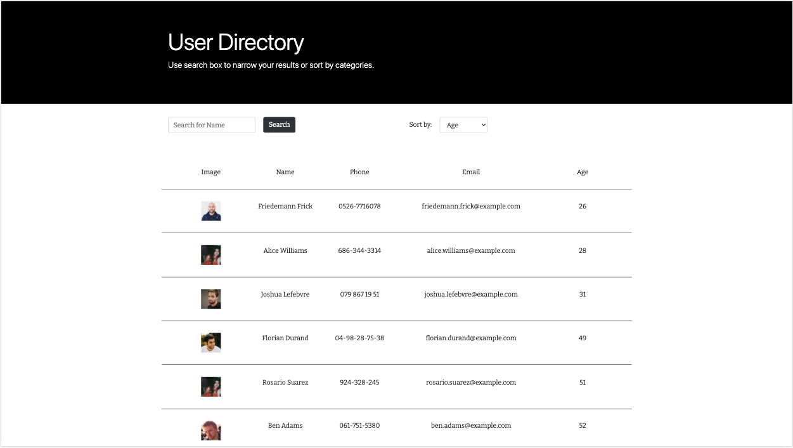

# React User Directory [](https://opensource.org/licenses/MIT)


## Description 

A user directory to search for specific user and sort by age. 


## Table of Contents 

* [Installation](#installation)
* [Usage](#usage)
* [License](#license)
* [Contribution](#contribution)
* [Tests](#tests)
* [Questions](#questions)


## Installation

Install dependencies:
```
npm install 
```


## Usage

* On page loading


* Enter and click on `Search` to search a user by name


* Click on `Sort by` dropdown, choose `Age` to sort by age


[Click here](https://react-user-directory-app.herokuapp.com/) for deployed link. 


## License

    Copyright 2020 React User Directory

    Permission is hereby granted, free of charge, to any person obtaining a copy of this software and associated documentation files (the "Software"), to deal in the Software without restriction, including without limitation the rights to use, copy, modify, merge, publish, distribute, sublicense, and/or sell copies of the Software, and to permit persons to whom the Software is furnished to do so, subject to the following conditions:
        
    The above copyright notice and this permission notice shall be included in all copies or substantial portions of the Software.
        
    THE SOFTWARE IS PROVIDED "AS IS", WITHOUT WARRANTY OF ANY KIND, EXPRESS OR IMPLIED, INCLUDING BUT NOT LIMITED TO THE WARRANTIES OF MERCHANTABILITY, FITNESS FOR A PARTICULAR PURPOSE AND NONINFRINGEMENT. IN NO EVENT SHALL THE AUTHORS OR COPYRIGHT HOLDERS BE LIABLE FOR ANY CLAIM, DAMAGES OR OTHER LIABILITY, WHETHER IN AN ACTION OF CONTRACT, TORT OR OTHERWISE, ARISING FROM, OUT OF OR IN CONNECTION WITH THE SOFTWARE OR THE USE OR OTHER DEALINGS IN THE SOFTWARE.
        

## Contribution 

No other contributions.


## Tests

None. 


## Questions 

GitHub Username: zhouyiartemiswang

GitHub Profile: [github.com/zhouyiartemiswang](https://github.com/zhouyiartemiswang) 

GitHub Repo: [github.com/zhouyiartemiswang/react_user_directory](https://github.com/zhouyiartemiswang/react_user_directory)

Please email additional questions to wzyzhouyi@gmail.com. 